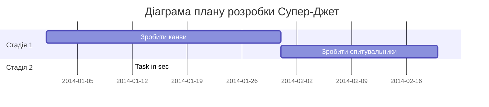

> Діаграма необов'язкова, але тут вартувало б подумати що ми хотіли б отримати на виході з семестру? Які етапи для цього потрібні?

# Зустрічі:
> Формат: Дата зустрічі. Учасники. Що зроблено на цю дату. Що домовлено зробити до наступної зустрічі. Додаткові нотатки за потреби.

1. 23-березня-2003.
    **Виконано**: Агнія зробила модель літака в Fusion 360. Петру: Не вийшло дописати прошивку.
   **Домовлено**: Василь робить ціннісні пропозиції. Агнія розбирається і пише ціннісні пропозиції. Петро доводить до пуття прошивку мікроконролера.
